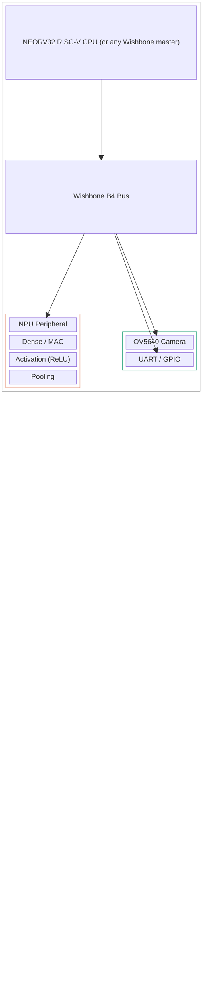
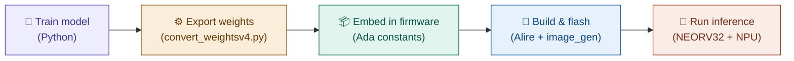
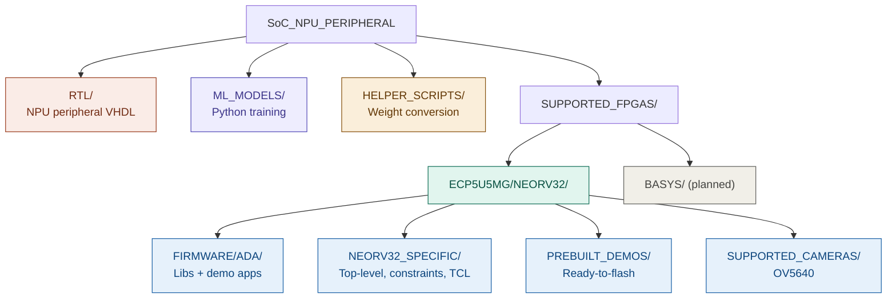

# SoC NPU Peripheral

**A reusable, Wishbone-compatible Neural Processing Unit for RISC-V soft-core SoCs.**

This project provides a VHDL peripheral that adds hardware-accelerated neural network inference to any system with a [Wishbone B4](https://cdn.opencores.org/downloads/wbspec_b4.pdf) bus. Instead of running matrix multiplications, activation functions, and pooling in software, you offload them to dedicated hardware — freeing your CPU for everything else.

The NPU ships with a fully tested reference implementation on the **Lattice ECP5** FPGA running the [NEORV32](https://github.com/stnolting/neorv32) RISC-V soft-core processor, complete with Ada firmware libraries and multiple demo applications (MNIST digit classification, breast cancer prediction, rock-paper-scissors). The NPU peripheral itself is portable to any Wishbone-compatible SoC.

---

## System Architecture



> **The NPU peripheral (`RTL/wb_peripheral.vhd`) is the reusable core.** Swap out the CPU, swap out the FPGA — the NPU just needs a Wishbone bus.

---

## Train → Deploy Workflow



1. **Train** a model on your PC using Python (see [`ML_MODELS/`](ML_MODELS/)).
2. **Export** the weights to fixed-point using [`HELPER_SCRIPTS/convert_weightsv4.py`](HELPER_SCRIPTS/convert_weightsv4.py).
3. **Embed** the exported weight arrays as Ada constants in your firmware project.
4. **Build** the firmware with Alire and generate a NEORV32 executable.
5. **Run** inference on the FPGA — firmware sends data to the NPU over Wishbone and reads back results.

---

## Repository Structure



---

## Quick Start

### Option A: Use a Prebuilt Demo (No Build Tools Needed)

If you just want to see the NPU in action on an ECP5 board:

1. Go to [`SUPPORTED_FPGAS/ECP5U5MG/NEORV32/PREBUILT_DEMOS/`](SUPPORTED_FPGAS/ECP5U5MG/NEORV32/PREBUILT_DEMOS/).
2. Flash the bitstream to your FPGA.
3. Upload the binary via the NEORV32 UART bootloader (19200 baud, 8N1).
4. Watch the inference results on the serial console.

### Option B: Build From Source

#### Prerequisites

| Tool | What It's For |
|------|---------------|
| [Alire](https://alire.ada.dev/) | Ada build system — installs GNAT + gprbuild automatically |
| `riscv64-elf-objcopy` | Part of the RISC-V GCC toolchain |
| [NEORV32 `image_gen`](https://github.com/stnolting/neorv32) | Converts binaries to NEORV32 executables |
| [Lattice Diamond](https://www.latticesemi.com/latticediamond) | FPGA synthesis (ECP5) |
| [Python 3.9+](https://www.python.org/) | Model training and weight conversion |

<details>
<summary><strong>Installing the RISC-V toolchain and image_gen</strong></summary>

**RISC-V GCC** (Ubuntu/Debian):
```bash
sudo apt install gcc-riscv64-unknown-elf
```

**NEORV32 image_gen**:
```bash
git clone https://github.com/stnolting/neorv32.git
cd neorv32/sw/image_gen
make
export PATH=$PATH:$(pwd)
```
</details>

#### Build firmware (example: MNIST 28×28 test)

```bash
cd SUPPORTED_FPGAS/ECP5U5MG/NEORV32/FIRMWARE/ADA/ADA_DEMO_FIRMWARE/MNIST_28x28_TEST

# Build the Ada project
alr build

# Convert to raw binary
riscv64-elf-objcopy -O binary bin/test_cases_neorv32 bin/test_cases_neorv32.bin

# Generate NEORV32 executable
image_gen -app_bin bin/test_cases_neorv32.bin bin/test_cases_neorv32.exe
```

Then upload `test_cases_neorv32.exe` via the NEORV32 UART bootloader.

#### Synthesize the FPGA design

```bash
cd SUPPORTED_FPGAS/ECP5U5MG/NEORV32/NEORV32_SPECIFIC
# Use the provided TCL script with Lattice Diamond
pnmainc create_neorv32_diamond.tcl
```

See [`NEORV32_SPECIFIC/README.md`](SUPPORTED_FPGAS/ECP5U5MG/NEORV32/NEORV32_SPECIFIC/README.md) for full details.

---

## Using the NPU in Your Own Design

The NPU peripheral (`RTL/wb_peripheral.vhd`) is a standalone Wishbone B4 slave. To use it in a different SoC:

1. Add `wb_peripheral.vhd` to your project.
2. Connect its Wishbone slave port to your bus interconnect.
3. Assign it a base address in your memory map.
4. Write to its control/data registers from your CPU to perform operations.

You do **not** need the NEORV32 or the ECP5. Any Wishbone master will work. See [`RTL/README.md`](RTL/README.md) for interface details.

---

## Demo Applications

| Demo | Model | Description |
|------|-------|-------------|
| **MNIST 28×28** | 784→dense→10 | Classifies handwritten digits |
| **MNIST 14×14** | 196→dense→10 | Smaller variant for constrained FPGAs |
| **Breast Cancer** | 30→dense→2 | Binary classification on tabular data |
| **Rock-Paper-Scissors** | Image→dense→3 | Grayscale image classification |
| **Integration Test** | Multi-model | Runs multiple models to verify all NPU operations |

Each demo includes the Python training code ([`ML_MODELS/`](ML_MODELS/)), the Ada firmware ([`SUPPORTED_FPGAS/.../ADA_DEMO_FIRMWARE/`](SUPPORTED_FPGAS/ECP5U5MG/NEORV32/FIRMWARE/ADA/ADA_DEMO_FIRMWARE/)), and prebuilt binaries ([`PREBUILT_DEMOS/`](SUPPORTED_FPGAS/ECP5U5MG/NEORV32/PREBUILT_DEMOS/)).

---

## Contributing

We welcome contributions — especially ports to new FPGA boards. See [`CONTRIBUTING.md`](CONTRIBUTING.md).

---


## Acknowledgments

- [NEORV32](https://github.com/stnolting/neorv32) by Stephan Nolting — the RISC-V soft-core processor.
- [VHDL Formatter](https://g2384.github.io/VHDLFormatter/) — for consistent VHDL code style.
